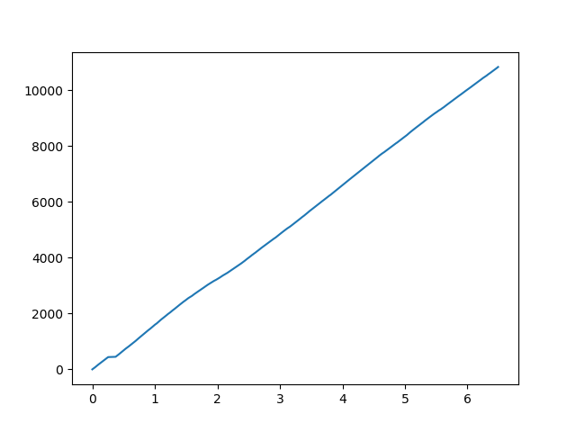
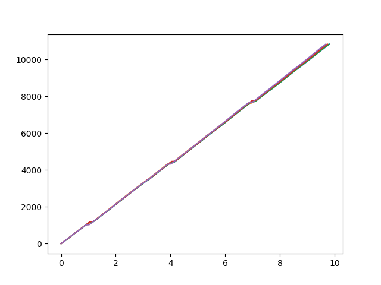
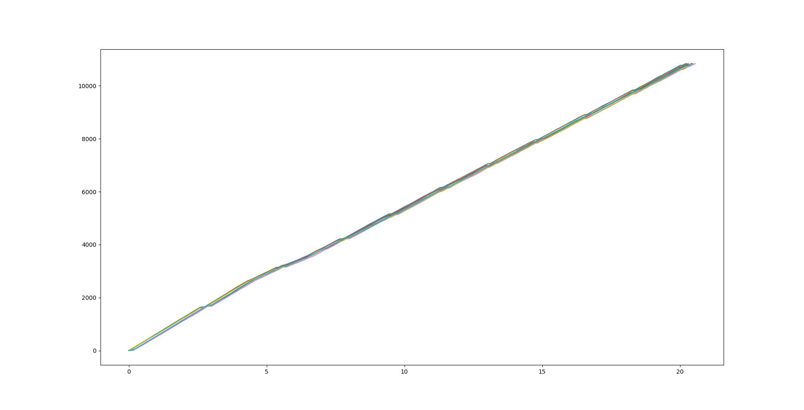
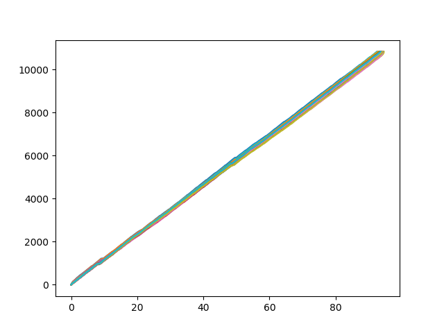
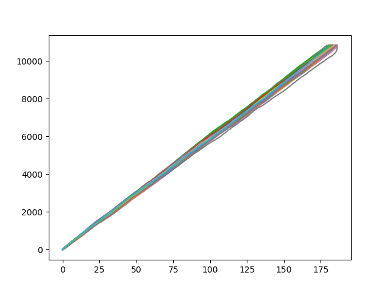

# This your assignment deployment report

## 1. Design and explain the data schema/structure for mysimbdp-coredms

The Google App Dataset contains 2 csv files. For this first Assignment I focused on the structure part of the server and I didn't look in detail at the optimization of the database. So I created exactly the same Tables as the ones in the csv files (one for apps and one for reviews). For the rest of the Assignment, I only used the Applications Table (and therefore the data of only one of the csvs). However, I had to write a python script to rewrite the csv data more cleanly. For example, the number of reviews is in int in my database but some line of the csv had a data that could not be converted to int ('3.0M' for example).

My 2 tables are :
```
CREATE TABLE Application(
	id UUID PRIMARY KEY,
	name text,
	category text,
	rating float,
	reviews int,
	size text,
	installs text,
	free Boolean,
	price_dollar float,
	content_rating text, 
	genres text,
	last_update date,
	current_ver text,
	android_ver text
);
```
And :
```
CREATE TABLE Review (
	id UUID PRIMARY KEY,
	app_name text,
	translated_review text,
	sentiment text,
	sentiment_polarity float,
	sentiment_subjectivity float
);
```

## 2. Explain how would you partition the data in mysimbdp-coredms into differentshards/partitions

If I had more time to devote to dividing my database into several tables to be faster, smoother and more understandable.
I would have created a Category table (id_cat, name_cat), a Content_Rating table (id_content, name_content), a Genres table (id_g, name_g) linked in OneToMany in the Application table, and an Android_Version table (id_ver, name_ver). The Application Table would therefore have been cleared of these data and would have had only one identifier to match with each of these data.
For example, the name of a category would only have been entered once in the database, whereas it is currently entered as many times as there are applications for this category.
It might have been interesting to see if the data insertion time would have been modified, but what is certain is that the consultation (Select * From...) of the data would have been much faster.
However, I have optimized a column of my table, the Type column, which contains only two possible values (Free or Paid) that I replaced with a Free column in my database containing a boolean (true if the application is free, false otherwise)

## 3. Write a mysimbdp-dataingest that takes data from your selected sources and stores thedata into mysimbdp-coredms

The created file is called mysimbdp_collect_data_data_csv.py (several can be launched simultaneously by launching the file mysimbdp_multi_threads.py).

## 4. Given your deployment environment, show the uploading performance (response time andfailure) of the tests for 1,5, 10, .., n of concurrent mysimbdp-dataingest pushing data intomysimbdp-coredms

In the script mysimbdp_multi_threads.py I am able to launch N concurrent script of mysimbdp_collect_data_data_csv.py . For each mysimbdp_collect_data_data_csv.py launched I save in a csv file the time taken by the script since the beginning of its insertions. Then I plot all the results :

Insertions Per Time (in seconds) when we run 1 insertion script :


Insertions Per Time (in seconds) when we run 5 insertion concurrent scripts


Insertions Per Time (in seconds) when we run 10 insertion concurrent scripts


Insertions Per Time (in seconds) when we run 50 insertion concurrent scripts


Insertions Per Time (in seconds) when we run 100 insertion concurrent scripts


## 5. Observing the performance and failure problems when you push a lot of data intomysimbdp-coredms (you do not need to worry about duplicated data in mysimbdp),propose the change of your deployment to avoid such problems (or explain why you do nothave any problem with your deployment)

We can see that the big data management of my assignment is not the best at all. When we run a higher number of insertion's scripts than the core's number of my machine the time increase a lot and when I tested 500 concurrent scripts, the large amount of datas leads to the failure of the system.

The good news is there are some methods that can help me to handle this problem. First, we saw it in the last questions, sharding will help me to have better results. But even with better an more effective results, the problem stay the same : at a point, with a large amount of data, one server will be submerge and it will be a failure of the system.

If I deploy my assignment in a Cloud, something very important will be to be able to spread the workload through different machines. A lot of Cloud Platforms give the opportunity to the customer to adjust the number of servers used when it is necessary and re-size to the initial number of servers when the workload decrease. Scalability is a (the ?) key point in Big Data Management !
